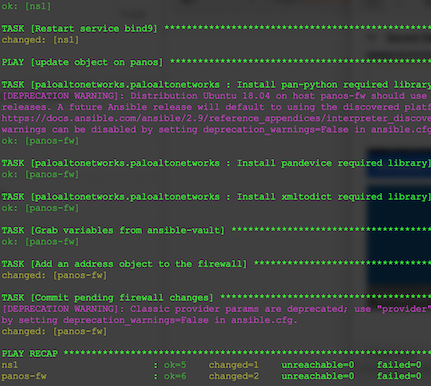

### Updating A, PTR record of a host on Bind and the related rules on Firewall

**update_host_ns_fw.yml:** Updates the A and PTR record of a **_host_** on bind9 and restarts
the bind service to take effect. Then it updates the object on PANOS (Palo Alto fw)
which defined the IP address of this **_host_**. and is used in policy rules. By this means:
- no need to bother with rules on fw (if the object is used properly in all related rules)
- DNS definitions and access rules about new IP address of the **_host_** is in effect.

> _IMPORTANT:_ The **_host_**, mentioned above is not the ansible hosts affected by playbook. That is
the **_host_** defined as A, PTR and object on those ansible hosts.

**host_ns_fw_update.yml:** Just the previous version of the playbook above which is updated
with variables (take this one as obsolete)



> Required Packages to install on host running ansible:
```
$ ansible-galaxy install paloaltonetworks.paloaltonetworks
$ sudo apt install python-pip
```

> Required pypi package on host running bind9:
```
$ pip install dnspython
```

---

### Bind Configuration for Nsupdate

1. Create a secret with dnssec-keygen:
```
$ dnssec-keygen -a HMAC-MD5 -n HOST -b 128 ansible-tsig
```

2. Inside the Kansible.*key file is the secret key which is used in named.conf.local file
in bind config root directory. Locate this key in a block as below:

```
key "ansible-tsig" {
        algorithm hmac-md5;
        secret "vhjd87dfteGZ7L112knekdI==";
};
```

3. Add the `allow-update` definition in the zones you want them to be able to changed
with nsupdate as below:

```
        zone "177.168.192.in-addr.arpa" {
                type master;
                file "/etc/bind/master/db.192.168.177.dyna";
                allow-transfer { my_dns; };
                allow-update {
                        key ansible-tsig;
                };
        };

```