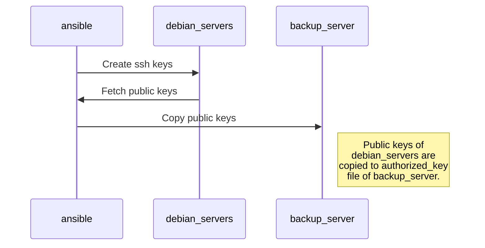
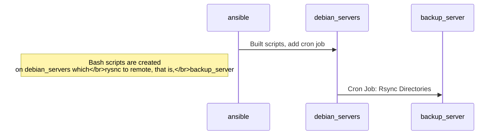

## Ansible Notes

**adduser.yml:** Adds common ansible user and password with the credentials in inventory file.
**authorized_key.yml:** Creates ssh keys on a number of desired servers and fetches those public keys.
Then, fetched public keys are copied to authorized_keys of another server.
**server_backup:** Creates scripts and cron jobs on desired servers to backup specified
directories to a central determined server(to which public keys are copied to its authorized_keys)

> Utilized role template from https://galaxy.ansible.com/geerlingguy/backup

####authourized_key.yml:

####server_backup.yml:

